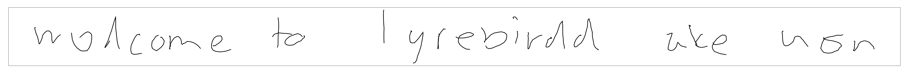
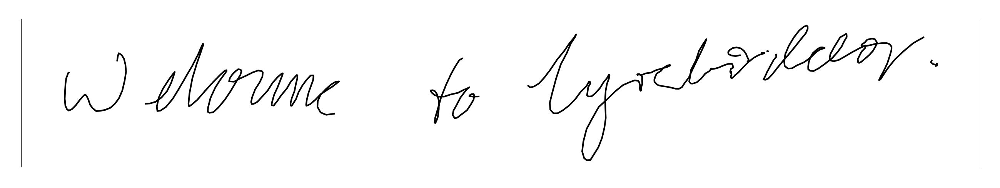
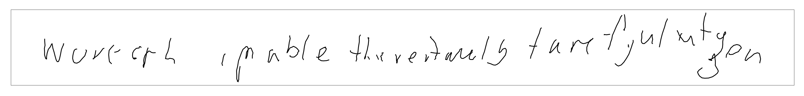

# Handwriting Generation Reproduce 

This repository is used to implement [this great paper](https://arxiv.org/pdf/1308.0850.pdf) by Alex Graves. 
### Requierements
```
Pytorch > 0.4
python 3.6
```

### train unconditional generation
```
python train_unconditional.py
```
### train conditional generation
```
python train_conditional.py
```
### generation samples
 conditional generation 
 conditional generation 
 conditional generation 
 unconditional generation 